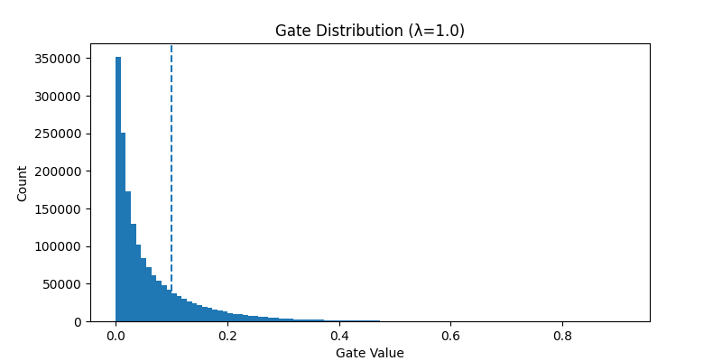

# Self-Pruning Neural Network — Report

**Tredence AI Engineering Internship — Case Study Submission**  
**Mona Mahendra Kumar Agrawal | RA2311003011733**

---

## 1. Why L1 on Sigmoid Gates Encourages Sparsity

The sigmoid function maps each learnable `gate_score` to a value in the range (0, 1). Without regularization, the network has no incentive to reduce these gate values, and most connections remain active.

To encourage sparsity, an L1 penalty is applied to the gate values. Since all gates are positive after the sigmoid transformation, this corresponds to penalizing their magnitude directly. Minimizing this term pushes many gates toward zero, effectively pruning the corresponding weights.

In practice, the sparsity penalty is implemented as the **mean of all gate values** rather than the raw sum. This normalizes the loss magnitude with respect to the number of parameters and ensures stable training while preserving the behavior of L1 regularization.

A key property of L1 regularization is that it applies a **constant gradient**, independent of the parameter magnitude. Unlike L2 regularization, where gradients shrink as values approach zero, L1 continues to push parameters down uniformly. This makes it effective at driving many gates to (near) zero.

In practice:
- Gates that contribute significantly to classification remain active because removing them would increase classification loss.
- Gates corresponding to weak or redundant connections are driven toward zero by the sparsity penalty.

The result is a sparse network that retains only the most important connections.

**Note on threshold:**  
Sparsity is measured as the percentage of gates with values below **0.1**. Since sigmoid outputs never reach exact zero, this threshold identifies gates that are effectively inactive.

---

## 2. Results

Training was conducted on CIFAR-10 for **35 epochs** across four values of λ using the Adam optimizer. Gate parameters were trained with a higher learning rate (`5e-3`) than weights (`1e-3`) to allow faster adaptation of pruning behavior.

All experiments were run with a fixed random seed (**23**) for reproducibility.

| Lambda | Test Accuracy | Sparsity (%) |
|:------:|:-------------:|:------------:|
| 0.05   | 61.01%        | 46.68%       |
| 0.1    | 61.29%        | 51.43%       |
| 0.5    | 61.46%        | 69.58%       |
| 1.0    | 61.78%        | 78.60%       |

---

## 3. Analysis

### Sparsity increases consistently with λ

As λ increases, the penalty on active gates becomes stronger, pushing more gates toward zero. Sparsity rises steadily from ~47% at λ = 0.05 to ~79% at λ = 1.0.

### Accuracy remains stable across all λ values

Despite large increases in sparsity, test accuracy remains within a narrow range (~61–62%). This indicates that the original dense network contains significant redundancy, and many connections can be removed without affecting performance.

### Higher λ slightly improves generalization

The highest λ (1.0) achieves both the highest sparsity and the best accuracy. This suggests a mild regularization effect: removing weak connections reduces noise and improves generalization.

### Accuracy is limited by architecture

All configurations converge to a similar accuracy range (~61–62%). This ceiling is due to the simplicity of the architecture (a fully connected MLP on flattened images), not the pruning mechanism itself. A convolutional model would likely achieve higher accuracy.

### Practical λ selection

For deployment scenarios:
- λ = 0.5 provides a strong trade-off (~70% sparsity with minimal accuracy loss)
- λ = 1.0 maximizes sparsity with no performance degradation in this setup

---

## 4. Gate Distribution

The plot below shows the distribution of gate values for the best model (λ = 1.0). The dashed vertical line represents the sparsity threshold (0.1).

The distribution exhibits a strong concentration of values near zero, confirming that most gates have been effectively pruned. A smaller set of gates remains active, corresponding to important connections.

This bimodal pattern — a dense cluster near zero and a sparse set of active gates — is the expected outcome of successful self-pruning.